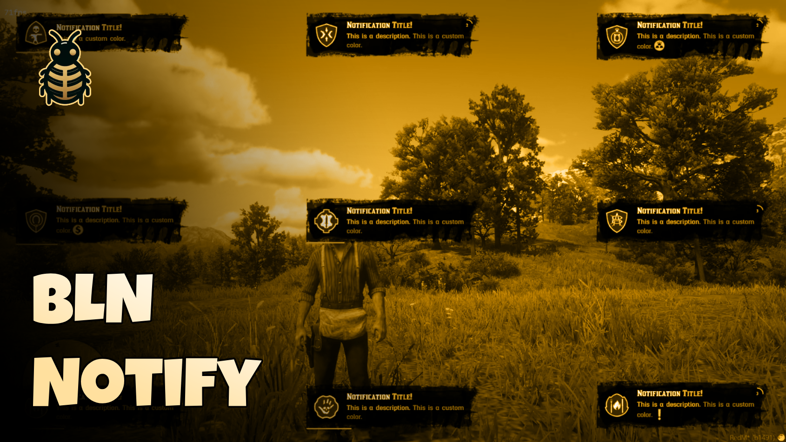

# BLN Notify

    
    
    

    
    

A standalone, flexible, and customizable notification system for RedM servers. BLN Notify provides a complete notification solution with support for animations, interactive key bindings, progress indicators, RTL languages, and extensive customization options.

## ✨ Features

- 🌐 **RTL Support**: Full right-to-left text direction support for Arabic, Hebrew, and other RTL languages
- 📚 **Predefined Templates**: 7 built-in templates (INFO, SUCCESS, ERROR, REWARD_MONEY, TIP, TIP_CASH, TIP_XP, TIP_GOLD) for quick usage
- 🧭 **9 Placement Options**: Support for all screen positions (top/middle/bottom × left/center/right)
- 📱 **Responsive Design**: Adapts to various screen sizes with automatic sizing
- 🎵 **Custom Sounds**: Configurable notification sounds using RedM's native sound system
- 🎛️ **Dual Modes**: Support for both advanced notifications (with background) and simple tip notifications
- 🌈 **Dynamic Text Formatting**: Inline color codes with named colors and hex values
- 🖼️ **Inline Images**: Embed icons/images directly in notification text using `~img:name~` syntax
- ⌨️ **Interactive Key Bindings**: Visual key indicators with event-driven key press handling
- 📊 **Progress Indicators**: Two types - progress bar and circular countdown timer
- 🎭 **Flexible Icons**: Support for both local icon files and external URLs
- ⏱️ **Custom Duration**: Configurable auto-dismiss time for each notification
- 🔀 **Content Alignment**: Adjustable text alignment (start, center, end)
- 🎬 **Smooth Animations**: Custom jelly-effect animations for entrance and exit
- 🖥️ **Client & Server**: Trigger notifications from both client-side and server-side scripts
- 🛠️ **Easy Integration**: Simple event-based API that works with any RedM resource
- 🎮 **RedM Optimized**: Specifically designed for RedM servers (Standalone, no dependencies)

---

## 📋 Documentation
Everything you need to know is here:
[Documentation Link](https://docs.bln-studio.com/docs/deps/bln_notify.html)

---

## 💬 Support

### Getting Help

- **Discord:** [Join our Discord server](https://discord.bln-studio.com/)
- **GitHub Issues:** [Create an issue](https://github.com/blnStudio/bln_notify/issues)
- **Examples:** Check `client/_Examples.lua` for code examples

---

## 🙏 Credits

- **BLN Studio** - Development, Maintenance, and support.
